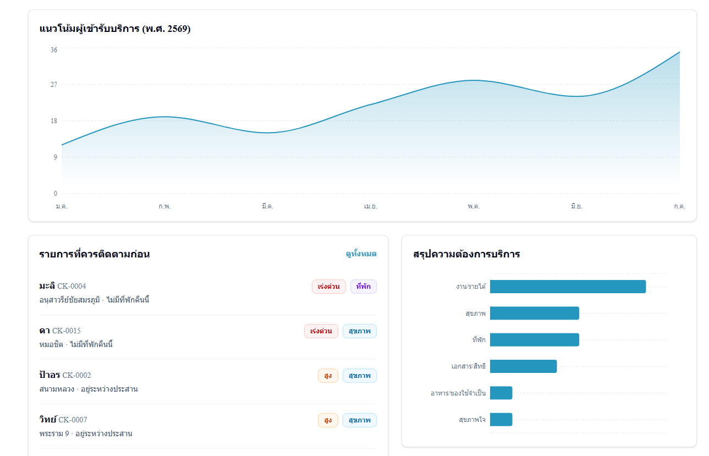
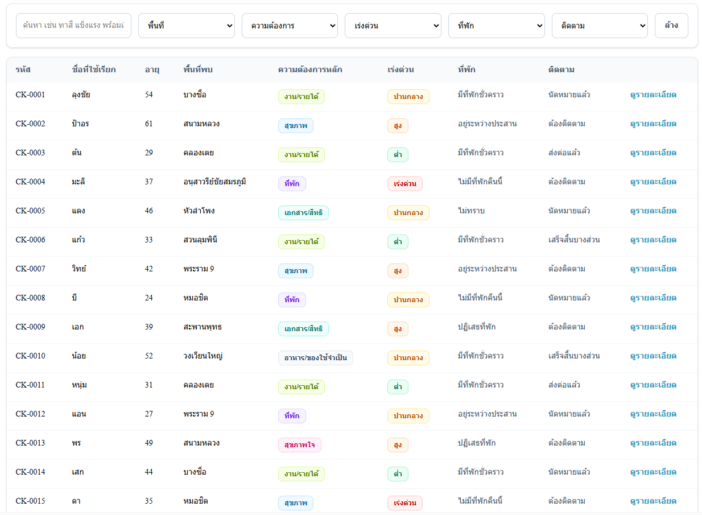
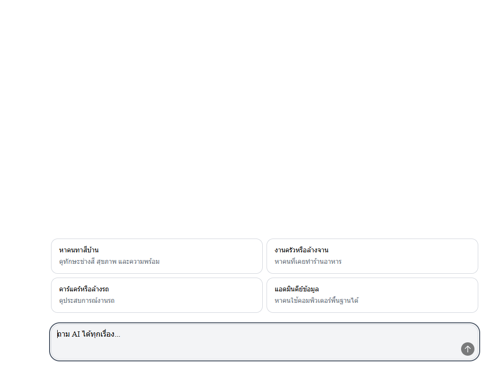

# เพื่อนพิง PuengPing

> A case-management and service-coordination prototype for supporting people experiencing homelessness, helping field teams identify urgent needs, coordinate referrals, and surface employment opportunities from one place.

PuengPing is a prototype web application designed for outreach teams, case workers, and service coordinators. It brings together case information across health, shelter, documents and welfare rights, mental wellbeing, skills, work readiness, and referral history. The app also includes a Thai-language AI assistant that helps staff search and summarize case information.

## Project idea

Supporting one person experiencing homelessness often involves many dimensions and many organizations. When information is scattered, staff can miss the full picture, lose continuity during follow-up, or overlook cases that need urgent support.

PuengPing was designed as a shared case-care workspace. It helps teams see a complete overview, search case data, group service needs, track referrals, and plan next steps while keeping human staff responsible for review and decision-making.

## Key features

### Overview dashboard

- Summarizes total service users and major service needs.
- Highlights cases that require urgent follow-up.
- Visualizes service-user trends, need categories, and risk levels.
- Shows recent referral activity.

### Case search and profiles


- Search by name, ID, area, skills, or case notes.
- Filter by area, needs, urgency, shelter status, and follow-up status.
- View health information, constraints, skills, work experience, and work readiness.
- Review staff notes, suggested next steps, and referral history.
- Supports both desktop and smaller screens.

### Service-needs grouping

Cases are grouped by support needs so staff can plan referrals around:

- Health support
- Shelter or safe space
- Documents, rights, and welfare
- Employment readiness
- Mental health and social support

### Thai-language AI assistant


- Ask natural-language questions about case data.
- Summarize health, risk, shelter, rights, and follow-up information.
- Find people whose skills or experience match work opportunities.
- Separate case facts from recommendations.
- Signal when the available data is insufficient.
- Uses the Typhoon API model `typhoon-v2.5-30b-a3b-instruct`.

## Example workflow

1. Open the dashboard to check urgent cases.
2. Search for cases by area or type of support needed.
3. Open a profile to review the person’s situation across health, shelter, rights, skills, and constraints.
4. Check referral history and plan the next step.
5. Ask the AI assistant a question such as “Who is ready for kitchen or dishwashing work?”
6. Review the result before contacting a service provider or employer.

## Tech stack

- [Next.js 16](https://nextjs.org/) with App Router
- [React 19](https://react.dev/) and TypeScript
- [Tailwind CSS 4](https://tailwindcss.com/)
- [Recharts](https://recharts.org/)
- [Framer Motion](https://motion.dev/)
- [Radix UI](https://www.radix-ui.com/) and shadcn
- [Typhoon API](https://opentyphoon.ai/)

## Main routes

| Route | Purpose |
| --- | --- |
| `/` | Dashboard and overview |
| `/people` | Search, filter, and browse service users |
| `/people/[id]` | Case details and referral history |
| `/services` | Group cases by service needs |
| `/ai` | Chat with the AI assistant |
| `/about-data` | Explanation of the mock data |

## Getting started

Requirements:

- Node.js version compatible with Next.js 16
- npm

Install dependencies:

```bash
git clone <repository-url>
cd keycard
npm install
```

Create `.env.local` if you want to use the AI page:

```env
TYPHOON_API_KEY=your_api_key_here

# Optional. The app uses this default URL when omitted.
TYPHOON_API_BASE_URL=https://api.opentyphoon.ai/v1
```

Start the development server:

```bash
npm run dev
```

Open [http://localhost:3000](http://localhost:3000).

## Available scripts

```bash
npm run dev    # Start the development server
npm run build  # Create a production build
npm run start  # Start the production server
npm run lint   # Run ESLint
```

## Data, privacy, and limitations

This project is a prototype. All 20 service-user cases are mock data for concept demonstration only. The app does not contain real personal data and is not connected to a real agency database or production case-management system.

When the AI feature is enabled, mock case data is sent to the Typhoon API as context for answering questions. Before using a similar system with real data, the product would need proper consent flows, role-based access control, data minimization, encryption, access logs, retention policies, and PDPA compliance.

AI output is intended to support search and decision-making. It should not be used to determine rights, screen people, make service-referral decisions, or assess employment suitability without human review, especially for health, safety, welfare, and work-readiness information.

## Future development

- Connect to a real database and role-based authentication.
- Support real-time case updates from field teams.
- Track referral status across organizations.
- Add alerts for urgent cases and upcoming follow-up tasks.
- Add citations and human-in-the-loop review for AI answers.
- Add audit logs, sensitive-data masking, and PDPA-ready safeguards.

## Project status

PuengPing is currently a prototype built to demonstrate the concept. It is not ready for real case-care use in a production environment.

---

**PuengPing — because effective support starts with seeing the whole person, not just one problem.**
